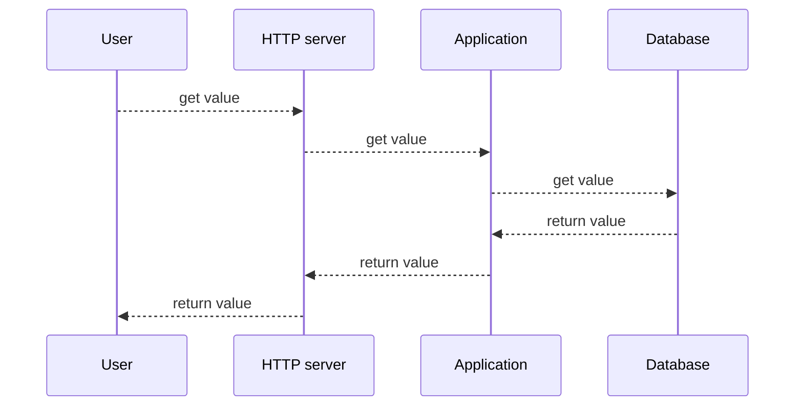

# The Responding Dark Laughter (_TRDL_) <!-- omit in toc -->

[](https://github.com/RichardLitt/standard-readme)
[](https://github.com/pre-commit/pre-commit)

> _TRDL_ is a web service that returns the value `42` through a public API, the
> value is fetched from a database.

- [Background](#background)
- [Install](#install)
- [Usage](#usage)
- [Test](#test)
- [SLA, SLIs and SLOs](#sla-slis-and-slos)
- [Contributing](#contributing)
- [License](#license)

## Background

> The requirements on TRDL are that the production system is a high availability
> service > with [a strict service level agreement](#sla-slis-and-slos)
> ([several](https://en.wiktionary.org/wiki/several#Determiner) "9" s uptime).
>
> The system consists of an HTTP server with some code running inside or behind
> it, and a database. It responds to a GET request as in [the example](#usage).



## Install

1. [Install Docker Compose](https://docs.docker.com/compose/install/).
2. Create [an `.env` file](https://thenewstack.io/what-is-the-docker-env-file-and-how-do-you-use-it/)
   with [the environment variable setting the superuser password for PostgreSQL](https://github.com/docker-library/docs/tree/master/postgres#postgres_password).
3. Create and start containers.

```shell
$ echo "POSTGRES_PASSWORD='$(openssl rand -base64 16)'" > .env
$ direnv allow
direnv: export +POSTGRES_PASSWORD
$ docker compose up --wait
[+] Running 18/18
 ✔ web 8 layers [⣿⣿⣿⣿⣿⣿⣿⣿]      0B/0B      Pulled  10.8s
   # ...
 ✔ db 8 layers [⣿⣿⣿⣿⣿⣿⣿⣿]      0B/0B      Pulled  14.4s
   # ...
[+] Building 43.2s (13/13) FINISHED
 # ...
[+] Running 8/8
 ✔ Network trdl_db       Created  0.2s
 ✔ Network trdl_app      Created  0.1s
 ✔ Volume "trdl_pgdata"  Created  0.0s
 ✔ Container trdl-db-1   Healthy  4.5s
 ✔ Container trdl-app-3  Healthy  32.9s
 ✔ Container trdl-app-1  Healthy  32.9s
 ✔ Container trdl-app-2  Healthy  32.9s
 ✔ Container trdl-web-1  Healthy  4.1s
 $ docker-compose run app flask init-db
 [+] Building 0.0s (0/0)
[+] Creating 3/3
 ✔ Network trdl_app     Created  0.1s
 ✔ Network trdl_db      Created  0.1s
 ✔ Container trdl-db-1  Created  0.1s
[+] Running 1/1
 ✔ Container trdl-db-1  Started  0.3s
[+] Building 0.0s (0/0)
```

## Usage

> Here is a sample interaction with TRDL:
>
> ```shell
> $ curl http://1.2.3.4/v1/value
> 42
> ```

## Test

> (...) once the application is deployed it will be used by [thousands](https://en.wiktionary.org/wiki/Appendix:Glossary#plural_number)
> of customers from day 1.

1. [Install the application](#install).
2. Install [`ab` - an Apache HTTP server benchmarking tool](https://httpd.apache.org/docs/2.4/programs/ab.html).
3. Run the benchmark.

```shell
$ ab -n 2000 -c 1 http://127.0.0.1:8080/v1/value
This is ApacheBench, Version 2.3 <$Revision: 1903618 $>
Copyright 1996 Adam Twiss, Zeus Technology Ltd, http://www.zeustech.net/
Licensed to The Apache Software Foundation, http://www.apache.org/

Benchmarking 127.0.0.1 (be patient)
Completed 200 requests
Completed 400 requests
Completed 600 requests
Completed 800 requests
Completed 1000 requests
Completed 1200 requests
Completed 1400 requests
Completed 1600 requests
Completed 1800 requests
Completed 2000 requests
Finished 2000 requests


Server Software:        nginx/1.25.1
Server Hostname:        127.0.0.1
Server Port:            8080

Document Path:          /v1/value
Document Length:        2 bytes

Concurrency Level:      1
Time taken for tests:   16.168 seconds
Complete requests:      2000
Failed requests:        0
Total transferred:      316000 bytes
HTML transferred:       4000 bytes
Requests per second:    123.70 [#/sec] (mean)
Time per request:       8.084 [ms] (mean)
Time per request:       8.084 [ms] (mean, across all concurrent requests)
Transfer rate:          19.09 [Kbytes/sec] received

Connection Times (ms)
              min  mean[+/-sd] median   max
Connect:        0    0   0.4      0      16
Processing:     4    8  12.5      6     323
Waiting:        4    7  12.4      6     322
Total:          4    8  12.7      7     339

Percentage of the requests served within a certain time (ms)
  50%      7
  66%      8
  75%      8
  80%      9
  90%     10
  95%     12
  98%     14
  99%     21
 100%    339 (longest request)
```

## SLA, SLIs and SLOs

> SLA level of [99.9 %](https://uptime.is/99.9) uptime/availability results in
> the following periods of allowed downtime/unavailability:
>
> - **Daily:** 1m 26s
> - **Weekly:** 10m 4.8s
> - **Monthly:** 43m 28s
> - **Quarterly:** 2h 10m 24s
> - **Yearly:** 8h 41m 38s

The quote below is from _[Example SLO Document](https://sre.google/workbook/slo-document/)_
by Steven Thurgood. The document is licensed under the [CC BY-NC-ND 4.0](https://creativecommons.org/licenses/by-nc-nd/4.0/)
license. © 2018 Google, Inc.

> ### Availability
>
> The proportion of successful requests, as measured from the load balancer
> metrics.
>
> Any HTTP status other than 500–599 is considered successful.
>
> - **99%**
>
> ### Latency
>
> The proportion of sufficiently fast requests, as measured from the load
> balancer metrics.
>
> _Sufficiently fast_ is defined as < 200 ms, or < 1,000 ms.
>
> - **90% of requests < 200 ms**
> - **99% of requests < 1,000 ms**

## Contributing

See [the contributing file](CONTRIBUTING.md)!

## License

[GPL-3.0](LICENSE) © [Maciej Strzelecki](mailto:mstrzele@users.noreply.github.com).
